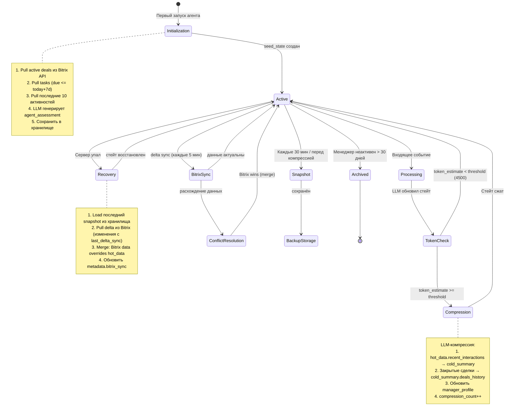

# AI-Native CRM — Часть 1: Архитектура генеративного стейта

**Статус:** Инженерный черновик v1.0
**Дата:** 2026-03-18
**Команда:** 2 человека
**Контекст:** LLM как Decision Engine. Bitrix24 = source of truth. Стейт агента = генеративный кэш.

---

## 1. JSON-схема генеративного стейта

### 1.1 Принципы проектирования

Окно контекста LLM — 8000 токенов. Весь стейт должен умещаться в промпт вместе с системными инструкциями (~1500 токенов) и входящим событием (~500 токенов). Бюджет на стейт: **≤5500 токенов** (~4000 слов в плотном JSON).

Разделение данных:
- **hot_data** — активные сделки, задачи на сегодня, последние 3–5 взаимодействий. Полный контекст, без потерь.
- **cold_summary** — сжатая LLM-история. Факты без деталей. Ссылки на Bitrix как anchor для восстановления.
- **metadata** — версионирование, счётчики компрессий, TTL.

Ключевое ограничение: **deal_id и contact_id никогда не генерируются LLM** — только копируются из Bitrix API. Это защита от галлюцинаций в anchor points.

### 1.2 Полная JSON-схема

```json
{
  "$schema": "http://json-schema.org/draft-07/schema#",
  "$id": "crm-agent-state-v1",
  "title": "CRMAgentState",
  "type": "object",
  "required": ["metadata", "hot_data", "cold_summary", "agent_context"],
  "properties": {

    "metadata": {
      "type": "object",
      "required": ["version", "state_id", "created_at", "updated_at", "compression_count", "token_estimate", "manager_id"],
      "properties": {
        "version":           { "type": "string", "pattern": "^\\d+\\.\\d+$", "description": "Версия схемы стейта" },
        "state_id":          { "type": "string", "format": "uuid" },
        "created_at":        { "type": "string", "format": "date-time" },
        "updated_at":        { "type": "string", "format": "date-time" },
        "compression_count": { "type": "integer", "minimum": 0 },
        "token_estimate":    { "type": "integer", "description": "Приблизительный размер стейта в токенах" },
        "compression_threshold": { "type": "integer", "default": 4500 },
        "manager_id":        { "type": "string", "description": "ID менеджера в Bitrix24" },
        "bitrix_sync": {
          "type": "object",
          "properties": {
            "last_full_sync":    { "type": "string", "format": "date-time" },
            "last_delta_sync":   { "type": "string", "format": "date-time" },
            "sync_status":       { "type": "string", "enum": ["ok", "stale", "error"] },
            "bitrix_webhook_url":{ "type": "string", "format": "uri" }
          }
        }
      }
    },

    "hot_data": {
      "type": "object",
      "description": "Активный контекст. Полные данные без сжатия.",
      "properties": {

        "active_deals": {
          "type": "array",
          "maxItems": 10,
          "description": "Текущие открытые сделки менеджера",
          "items": {
            "type": "object",
            "required": ["deal_id", "title", "stage", "amount", "contact_id", "updated_at"],
            "properties": {
              "deal_id":       { "type": "string", "description": "ID в Bitrix24 — ТОЛЬКО из API, не генерировать" },
              "title":         { "type": "string" },
              "stage":         { "type": "string", "description": "Стадия воронки в Bitrix24" },
              "stage_code":    { "type": "string", "description": "Технический код стадии (C1:NEW, C1:PREPARATION и т.д.)" },
              "amount":        { "type": "number" },
              "currency":      { "type": "string", "default": "RUB" },
              "contact_id":    { "type": "string", "description": "ID контакта в Bitrix24 — ТОЛЬКО из API" },
              "company_id":    { "type": "string" },
              "contact_name":  { "type": "string" },
              "contact_phone": { "type": "string" },
              "updated_at":    { "type": "string", "format": "date-time" },
              "close_date":    { "type": "string", "format": "date" },
              "probability":   { "type": "integer", "minimum": 0, "maximum": 100 },
              "next_action": {
                "type": "object",
                "properties": {
                  "description": { "type": "string" },
                  "due_date":    { "type": "string", "format": "date" },
                  "task_id":     { "type": "string", "description": "ID задачи в Bitrix24 если создана" }
                }
              },
              "recent_notes":  {
                "type": "array",
                "maxItems": 3,
                "items": { "type": "string" },
                "description": "Последние 3 заметки/комментария по сделке"
              },
              "agent_assessment": {
                "type": "string",
                "description": "LLM-оценка статуса сделки. Может меняться агентом."
              }
            }
          }
        },

        "todays_tasks": {
          "type": "array",
          "maxItems": 15,
          "description": "Задачи на сегодня (дедлайн <= today+1d)",
          "items": {
            "type": "object",
            "required": ["task_id", "title", "deal_id", "due_date", "priority"],
            "properties": {
              "task_id":   { "type": "string", "description": "ID задачи в Bitrix24 — ТОЛЬКО из API" },
              "title":     { "type": "string" },
              "deal_id":   { "type": "string" },
              "due_date":  { "type": "string", "format": "date-time" },
              "priority":  { "type": "string", "enum": ["low", "normal", "high"] },
              "completed": { "type": "boolean", "default": false }
            }
          }
        },

        "recent_interactions": {
          "type": "array",
          "maxItems": 5,
          "description": "Последние 5 событий/звонков/писем",
          "items": {
            "type": "object",
            "required": ["type", "deal_id", "contact_id", "timestamp", "summary"],
            "properties": {
              "type":       { "type": "string", "enum": ["call", "email", "meeting", "comment", "stage_change", "task_created"] },
              "deal_id":    { "type": "string" },
              "contact_id": { "type": "string" },
              "timestamp":  { "type": "string", "format": "date-time" },
              "summary":    { "type": "string", "maxLength": 300, "description": "Краткое резюме взаимодействия" },
              "outcome":    { "type": "string", "enum": ["positive", "neutral", "negative", "unknown"] }
            }
          }
        }
      }
    },

    "cold_summary": {
      "type": "object",
      "description": "Сжатая LLM-история. Факты, паттерны, аномалии. Детали отброшены.",
      "properties": {

        "deals_history": {
          "type": "array",
          "description": "Закрытые/заархивированные сделки в сжатом виде",
          "items": {
            "type": "object",
            "required": ["deal_id", "outcome", "amount", "closed_at", "summary"],
            "properties": {
              "deal_id":   { "type": "string", "description": "Anchor point к Bitrix24" },
              "outcome":   { "type": "string", "enum": ["won", "lost", "cancelled"] },
              "amount":    { "type": "number" },
              "closed_at": { "type": "string", "format": "date" },
              "duration_days": { "type": "integer" },
              "summary":   { "type": "string", "maxLength": 200, "description": "1-2 предложения: что произошло и почему" },
              "lost_reason": { "type": "string" }
            }
          }
        },

        "manager_profile": {
          "type": "object",
          "description": "Паттерны работы менеджера, выведенные из истории",
          "properties": {
            "avg_deal_cycle_days":    { "type": "number" },
            "win_rate_percent":       { "type": "number" },
            "preferred_contact_time": { "type": "string", "description": "Паттерн: когда контакты чаще отвечают" },
            "strong_segments":        { "type": "array", "items": { "type": "string" } },
            "weak_segments":          { "type": "array", "items": { "type": "string" } },
            "top_lost_reasons":       { "type": "array", "items": { "type": "string" } },
            "narrative":              { "type": "string", "maxLength": 500, "description": "Свободный нарратив об эффективности" }
          }
        },

        "client_insights": {
          "type": "array",
          "description": "Ключевые инсайты по контактам из закрытых сделок",
          "items": {
            "type": "object",
            "properties": {
              "contact_id": { "type": "string", "description": "Anchor point к Bitrix24" },
              "contact_name": { "type": "string" },
              "insight": { "type": "string", "maxLength": 150 }
            }
          }
        },

        "compressed_at":       { "type": "string", "format": "date-time" },
        "compression_model":   { "type": "string", "description": "Модель, выполнившая компрессию (e.g. gpt-4o-mini)" },
        "source_events_count": { "type": "integer", "description": "Сколько событий было сжато в этот summary" }
      }
    },

    "agent_context": {
      "type": "object",
      "description": "Рабочий контекст агента: незакрытые вопросы, pending actions",
      "properties": {
        "pending_actions": {
          "type": "array",
          "maxItems": 10,
          "description": "Действия, запланированные агентом, но ещё не выполненные",
          "items": {
            "type": "object",
            "required": ["action_type", "created_at", "status"],
            "properties": {
              "action_type": { "type": "string", "enum": ["create_task", "send_reminder", "update_stage", "schedule_call", "create_note"] },
              "deal_id":     { "type": "string" },
              "params":      { "type": "object" },
              "created_at":  { "type": "string", "format": "date-time" },
              "status":      { "type": "string", "enum": ["pending", "executed", "failed"] },
              "error":       { "type": "string" }
            }
          }
        },
        "open_questions": {
          "type": "array",
          "maxItems": 5,
          "description": "Вопросы, заданные менеджером, ждущие ответа или действия",
          "items": { "type": "string" }
        },
        "last_agent_response_summary": {
          "type": "string",
          "maxLength": 300,
          "description": "Краткое резюме последнего ответа агента"
        }
      }
    }
  }
}
```

### 1.3 Пример заполненного стейта

```json
{
  "metadata": {
    "version": "1.0",
    "state_id": "a3f8c1d2-4e5b-7a9c-b2d3-e4f5a6b7c8d9",
    "created_at": "2026-03-10T09:00:00Z",
    "updated_at": "2026-03-18T14:32:00Z",
    "compression_count": 2,
    "token_estimate": 3200,
    "compression_threshold": 4500,
    "manager_id": "42",
    "bitrix_sync": {
      "last_full_sync": "2026-03-18T09:00:00Z",
      "last_delta_sync": "2026-03-18T14:30:00Z",
      "sync_status": "ok",
      "bitrix_webhook_url": "https://crm.company.ru/rest/42/abc123/"
    }
  },

  "hot_data": {
    "active_deals": [
      {
        "deal_id": "1547",
        "title": "Внедрение 1С для ООО Альфа",
        "stage": "Коммерческое предложение",
        "stage_code": "C1:PREPARATION",
        "amount": 450000,
        "currency": "RUB",
        "contact_id": "891",
        "company_id": "234",
        "contact_name": "Иванов Сергей Петрович",
        "contact_phone": "+7 916 123-45-67",
        "updated_at": "2026-03-18T11:00:00Z",
        "close_date": "2026-03-31",
        "probability": 65,
        "next_action": {
          "description": "Отправить КП на почту, согласованное вчера",
          "due_date": "2026-03-19",
          "task_id": "7823"
        },
        "recent_notes": [
          "18.03: Звонок 12 мин. Иванов ждёт КП до 19.03. Бюджет подтверждён.",
          "15.03: Встреча. Конкурент — Ай-Ти-Ком, предложили 380к. Наш плюс — поддержка.",
          "10.03: Первый контакт. Пришёл по рекомендации от ООО Бета."
        ],
        "agent_assessment": "Высокая вероятность закрытия. Критично: отправить КП сегодня-завтра. Конкурент дешевле на 15%, нужно акцентировать поддержку 24/7."
      },
      {
        "deal_id": "1612",
        "title": "CRM-интеграция для ИП Мартынов",
        "stage": "Переговоры",
        "stage_code": "C1:EXECUTING",
        "amount": 120000,
        "currency": "RUB",
        "contact_id": "944",
        "company_id": null,
        "contact_name": "Мартынов Андрей",
        "contact_phone": "+7 903 987-65-43",
        "updated_at": "2026-03-16T15:00:00Z",
        "close_date": "2026-04-15",
        "probability": 40,
        "next_action": {
          "description": "Позвонить — не выходил на связь 2 дня",
          "due_date": "2026-03-18",
          "task_id": null
        },
        "recent_notes": [
          "16.03: Не взял трубку. SMS отправлено.",
          "14.03: Зависла на этапе подписания договора уже 10 дней."
        ],
        "agent_assessment": "Риск: сделка застряла. Молчание 2 дня после согласования. Проверить — не ушёл ли к конкуренту. Если сегодня нет ответа — эскалация руководителю."
      }
    ],

    "todays_tasks": [
      {
        "task_id": "7823",
        "title": "Отправить КП для ООО Альфа",
        "deal_id": "1547",
        "due_date": "2026-03-19T18:00:00Z",
        "priority": "high",
        "completed": false
      },
      {
        "task_id": "7791",
        "title": "Позвонить Мартынову",
        "deal_id": "1612",
        "due_date": "2026-03-18T17:00:00Z",
        "priority": "high",
        "completed": false
      }
    ],

    "recent_interactions": [
      {
        "type": "call",
        "deal_id": "1547",
        "contact_id": "891",
        "timestamp": "2026-03-18T12:00:00Z",
        "summary": "Иванов подтвердил бюджет 450к. Ждёт КП до 19.03. Конкурент дешевле.",
        "outcome": "positive"
      },
      {
        "type": "stage_change",
        "deal_id": "1612",
        "contact_id": "944",
        "timestamp": "2026-03-16T15:00:00Z",
        "summary": "Сделка 1612 перешла в Переговоры. Договор согласован устно.",
        "outcome": "neutral"
      }
    ]
  },

  "cold_summary": {
    "deals_history": [
      {
        "deal_id": "1401",
        "outcome": "won",
        "amount": 280000,
        "closed_at": "2026-02-28",
        "duration_days": 45,
        "summary": "Внедрение складского учёта для ООО Гамма. Закрыли после 3 встреч. Ключевой фактор — демо на реальных данных клиента.",
        "lost_reason": null
      },
      {
        "deal_id": "1388",
        "outcome": "lost",
        "amount": 600000,
        "closed_at": "2026-02-15",
        "duration_days": 62,
        "summary": "Крупный тендер потеряли из-за требования интеграции с SAP — нет в нашем продукте.",
        "lost_reason": "Отсутствие интеграции с SAP"
      }
    ],
    "manager_profile": {
      "avg_deal_cycle_days": 38,
      "win_rate_percent": 58,
      "preferred_contact_time": "10:00-13:00 по будням",
      "strong_segments": ["Малый бизнес 1С", "Торговля"],
      "weak_segments": ["Крупный Enterprise", "Производство"],
      "top_lost_reasons": ["Цена конкурента", "Нет интеграции с SAP", "Долгое принятие решений у клиента"],
      "narrative": "Менеджер эффективен в сегменте МСБ. Конверсия падает на сделках >500к из-за длинного цикла согласований. Сильная сторона — демонстрации продукта."
    },
    "client_insights": [
      {
        "contact_id": "744",
        "contact_name": "Петров В.И.",
        "insight": "Принимает решения только после согласования с бухгалтерией. Звонить после 14:00."
      }
    ],
    "compressed_at": "2026-03-10T09:00:00Z",
    "compression_model": "gpt-4o-mini",
    "source_events_count": 87
  },

  "agent_context": {
    "pending_actions": [
      {
        "action_type": "create_task",
        "deal_id": "1612",
        "params": {
          "title": "Эскалация: Мартынов молчит 2 дня",
          "assignee_id": "manager",
          "due_date": "2026-03-18"
        },
        "created_at": "2026-03-18T13:00:00Z",
        "status": "pending",
        "error": null
      }
    ],
    "open_questions": [
      "Менеджер спросил: 'Стоит ли дать скидку Иванову для конкуренции с Ай-Ти-Ком?' — ответ не дан"
    ],
    "last_agent_response_summary": "Проанализировал сделки. Приоритет: КП для Альфы сегодня. Мартынов — риск, рекомендовал позвонить до 17:00."
  }
}
```

---

## 2. Lifecycle стейта

### 2.1 Mermaid-диаграмма



### 2.2 Описание каждого этапа

#### Этап 1: Initialization (Создание стейта)

**Триггер:** Первый запрос к агенту от нового менеджера или явный сброс стейта.

**Процесс:**
1. Генерируем `state_id` (UUID), фиксируем `created_at`.
2. Вызываем Bitrix24 REST API:
   - `crm.deal.list` — активные сделки менеджера (фильтр: `STAGE_SEMANTIC_ID != F AND STAGE_SEMANTIC_ID != S`)
   - `tasks.task.list` — задачи с дедлайном `<= today + 7 days`
   - `crm.activity.list` — последние 10 активностей (звонки, письма, встречи)
3. Преобразуем ответ Bitrix в структуру `hot_data`. **deal_id и contact_id берём as-is из API.**
4. Вызываем LLM с системным промптом (см. Часть 3) и `event: {type: "state_initialization"}`. LLM заполняет `agent_assessment` для каждой сделки и `agent_context.pending_actions`.
5. `token_estimate` считаем как `len(json.dumps(state)) / 4` (грубая оценка: 1 токен ≈ 4 символа).
6. Сохраняем стейт в хранилище (Redis с TTL 7d + PostgreSQL backup).

**Invariant:** После Initialization `metadata.bitrix_sync.sync_status == "ok"`.

---

#### Этап 2: Evolution (Эволюция стейта при событии)

**Триггер:** Любое входящее событие — сообщение менеджера, webhook из Bitrix, scheduled delta sync.

**Процесс:**
1. Загружаем текущий стейт из хранилища.
2. Формируем промпт: `[system_prompt] + [current_state_json] + [incoming_event_json]`.
3. LLM возвращает `{updated_state, actions[], response}` (формат — Часть 3).
4. Валидируем ответ LLM:
   - Все `deal_id` и `contact_id` в `updated_state` должны совпадать с теми, что были в `current_state` или пришли из event (если event — webhook из Bitrix). **Новые ID не допускаются.**
   - `token_estimate` пересчитываем.
5. Применяем `actions[]` через Bitrix API (create_task, update_stage и т.д.).
6. Сохраняем `updated_state`.
7. Возвращаем `response` менеджеру.

**Failsafe:** Если LLM вернул невалидный JSON или `deal_id` не из белого списка — откатываемся к предыдущему стейту, логируем ошибку.

---

#### Этап 3: Compression (Сжатие)

**Триггер:** `token_estimate >= metadata.compression_threshold` (по умолчанию 4500 токенов).

**Процесс:**
1. Выбираем кандидатов на сжатие:
   - `hot_data.recent_interactions` старше 3 дней → в `cold_summary`
   - Сделки со статусом `won/lost/cancelled` в `hot_data.active_deals` → в `cold_summary.deals_history`
   - `hot_data.todays_tasks` с `completed == true` → удаляем или архивируем
2. Вызываем LLM с промптом компрессии:
   ```
   Задача: сжать данные для переноса в cold_summary.
   Сохранить: deal_id, contact_id (anchor points), ключевые факты, исходы.
   Удалить: детальные диалоги, промежуточные шаги, дублирующую информацию.
   Обновить: manager_profile на основе закрытых сделок.
   ```
3. LLM возвращает новый блок `cold_summary` и обрезанный `hot_data`.
4. Инкрементируем `compression_count`, фиксируем `cold_summary.compressed_at`.
5. Делаем snapshot перед сохранением.

**Ограничение:** Компрессию не запускаем чаще 1 раза в 10 минут (debounce), чтобы не тратить токены на пустые циклы.

---

#### Этап 4: Recovery (Восстановление после сбоя)

**Триггер:** Старт сервиса после падения / timeout на загрузку стейта из основного хранилища.

**Процесс:**
1. Загружаем последний snapshot из PostgreSQL backup (по `manager_id`, последняя запись).
2. Смотрим `metadata.bitrix_sync.last_delta_sync`. Запрашиваем дельту из Bitrix: все изменения с `last_delta_sync` по `now`.
3. Merge-стратегия: **Bitrix wins** для всех полей, привязанных к объектам Bitrix (`stage`, `amount`, `close_date`, `completed`). Поля агента (`agent_assessment`, `cold_summary`) — оставляем из snapshot.
4. Обновляем `metadata.bitrix_sync.last_delta_sync = now`, `sync_status = "ok"`.
5. `token_estimate` пересчитываем. Если превышает порог — запускаем Compression.

**Максимальная потеря данных:** равна интервалу между snapshot и падением. Все критичные бизнес-данные восстанавливаются из Bitrix.

---

### 2.3 Хранилище стейта

```
Redis (primary, TTL 7 дней)
  key: agent_state:{manager_id}
  value: JSON стейта

PostgreSQL (backup snapshots)
  table: agent_state_snapshots
  columns: id, manager_id, state_json, created_at, token_estimate
  retention: 30 дней

Snapshot schedule: каждые 30 минут + перед каждой компрессией
```

---

## 3. System Prompt для агента

### 3.1 Полный системный промпт

```
You are a CRM assistant for a sales manager. You process events and maintain the manager's state.

## YOUR ROLE
- Analyze incoming events in the context of the current state
- Update the state to reflect new information
- Propose concrete actions (tasks, reminders, stage changes in Bitrix24)
- Give brief, actionable responses to the manager in Russian

## STRICT RULES — NEVER VIOLATE

1. NEVER invent or generate deal_id, contact_id, task_id, company_id.
   These values ONLY come from the current state or from the incoming event (if it is a Bitrix webhook).
   If you need to reference an entity that has no ID in the state — describe it by name and flag: "requires_bitrix_lookup: true".

2. NEVER add deals or contacts to active_deals or recent_interactions that are not present in the current state
   and not provided in the incoming event.

3. NEVER hallucinate facts. If the state does not contain information — say "данных нет" or ask the manager.

4. agent_assessment is your opinion — mark it clearly if it is an inference, not a fact from the state.

5. token_estimate must be recalculated after every state update: len(json.dumps(updated_state)) / 4.

6. compression_count must NOT be changed during normal event processing. Only the compression routine changes it.

## INPUT FORMAT

You receive a JSON object with two fields:

```json
{
  "current_state": { ...CRMAgentState... },
  "event": {
    "type": "manager_message | bitrix_webhook | scheduled_sync | state_initialization",
    "timestamp": "ISO8601",
    "payload": { ... }
  }
}
```

Event types and their payload:

- "manager_message": payload = {"text": "...", "manager_id": "..."}
- "bitrix_webhook": payload = {"event_type": "ONCRMDEALADD | ONCRMDEALUPDATE | ...", "data": {...}}
- "scheduled_sync": payload = {"deals_delta": [...], "tasks_delta": [...], "activities_delta": [...]}
- "state_initialization": payload = {"deals": [...], "tasks": [...], "activities": [...]}

## OUTPUT FORMAT

Return ONLY a valid JSON object, no markdown, no explanation outside the JSON:

```json
{
  "updated_state": { ...CRMAgentState... },
  "actions": [
    {
      "action_type": "create_task | update_deal_stage | create_note | send_reminder | schedule_call",
      "deal_id": "string | null",
      "contact_id": "string | null",
      "params": { ... },
      "requires_bitrix_lookup": false,
      "reasoning": "string — one sentence why this action"
    }
  ],
  "response": "string — ответ менеджеру на русском, до 200 символов. Если событие не требует ответа (webhook, sync) — null",
  "compression_recommended": false,
  "warnings": []
}
```

## COMPRESSION RULES

### Когда рекомендовать компрессию:
- `updated_state.metadata.token_estimate >= updated_state.metadata.compression_threshold`
- В этом случае установи `compression_recommended: true` в ответе
- Компрессию выполняет отдельный вызов LLM — не ты в этом же ответе

### Что сохранять при компрессии (при вызове с event.type = "compression_request"):
- Все anchor points: deal_id, contact_id — ОБЯЗАТЕЛЬНО
- Исход сделки: won/lost/cancelled + причина
- Ключевые факты о контакте (предпочтения, ограничения, паттерны)
- Паттерны менеджера для manager_profile

### Что удалять при компрессии:
- Детальные тексты переговоров (оставить 1-2 предложения)
- Промежуточные статусы (оставить итоговый)
- Повторяющуюся информацию
- Задачи со статусом completed
- recent_interactions старше 3 дней (если > 5 штук)

## EVENT PROCESSING GUIDE

### manager_message
1. Определи намерение: вопрос / команда / информация
2. Если вопрос — найди ответ в state или признай отсутствие данных
3. Если команда ("создай задачу", "перенеси сделку") — добавь в actions[]
4. Если информация ("звонил клиент, сказал что...") — обнови recent_interactions и agent_assessment
5. Обнови last_agent_response_summary

### bitrix_webhook
1. Найди затронутую сделку/задачу в hot_data по ID
2. Обнови поля согласно данным из webhook (stage, amount и т.д.)
3. Если сделка закрылась (won/lost) — перенеси в cold_summary кандидатом (не удаляй сразу)
4. response = null (менеджер не ждёт ответа на webhook)

### scheduled_sync
1. Применяй deals_delta: обновляй existing, добавляй new (если в воронке менеджера)
2. Применяй tasks_delta: обновляй, добавляй, помечай completed
3. Если deals_delta содержит новые сделки с незнакомыми deal_id — добавляй их в hot_data.active_deals
4. response = null

### state_initialization
1. Заполни hot_data из payload (deals → active_deals, tasks → todays_tasks, activities → recent_interactions)
2. Сгенерируй agent_assessment для каждой сделки
3. Заполни agent_context.pending_actions если видишь просроченные задачи или застрявшие сделки
4. response = краткое резюме ситуации менеджеру
```

### 3.2 Примеры Input/Output

#### Пример 1: manager_message — вопрос

**Input:**
```json
{
  "current_state": {
    "metadata": { "version": "1.0", "state_id": "a3f8...", "manager_id": "42", "token_estimate": 3200, "compression_count": 2, "compression_threshold": 4500, "updated_at": "2026-03-18T14:32:00Z", "created_at": "2026-03-10T09:00:00Z", "bitrix_sync": { "last_full_sync": "2026-03-18T09:00:00Z", "last_delta_sync": "2026-03-18T14:30:00Z", "sync_status": "ok" } },
    "hot_data": {
      "active_deals": [
        { "deal_id": "1547", "title": "Внедрение 1С для ООО Альфа", "stage": "Коммерческое предложение", "stage_code": "C1:PREPARATION", "amount": 450000, "currency": "RUB", "contact_id": "891", "contact_name": "Иванов С.П.", "contact_phone": "+7 916 123-45-67", "updated_at": "2026-03-18T11:00:00Z", "close_date": "2026-03-31", "probability": 65, "next_action": { "description": "Отправить КП", "due_date": "2026-03-19", "task_id": "7823" }, "recent_notes": ["18.03: Иванов ждёт КП до 19.03. Конкурент дешевле на 15%."], "agent_assessment": "Высокая вероятность. Конкурент — Ай-Ти-Ком." }
      ],
      "todays_tasks": [ { "task_id": "7823", "title": "Отправить КП для ООО Альфа", "deal_id": "1547", "due_date": "2026-03-19T18:00:00Z", "priority": "high", "completed": false } ],
      "recent_interactions": [ { "type": "call", "deal_id": "1547", "contact_id": "891", "timestamp": "2026-03-18T12:00:00Z", "summary": "Иванов подтвердил бюджет 450к. Конкурент дешевле.", "outcome": "positive" } ]
    },
    "cold_summary": {
      "deals_history": [], "manager_profile": { "avg_deal_cycle_days": 38, "win_rate_percent": 58, "strong_segments": ["Малый бизнес 1С"], "top_lost_reasons": ["Цена конкурента"], "narrative": "Эффективен в МСБ. Конверсия падает на сделках >500к." }, "client_insights": [], "compressed_at": "2026-03-10T09:00:00Z", "compression_model": "gpt-4o-mini", "source_events_count": 87
    },
    "agent_context": { "pending_actions": [], "open_questions": [], "last_agent_response_summary": "КП для Альфы — приоритет." }
  },
  "event": {
    "type": "manager_message",
    "timestamp": "2026-03-18T15:00:00Z",
    "payload": {
      "text": "Стоит ли дать скидку Иванову? Конкурент дешевле на 15%.",
      "manager_id": "42"
    }
  }
}
```

**Output:**
```json
{
  "updated_state": {
    "metadata": { "version": "1.0", "state_id": "a3f8...", "manager_id": "42", "token_estimate": 3280, "compression_count": 2, "compression_threshold": 4500, "updated_at": "2026-03-18T15:00:00Z", "created_at": "2026-03-10T09:00:00Z", "bitrix_sync": { "last_full_sync": "2026-03-18T09:00:00Z", "last_delta_sync": "2026-03-18T14:30:00Z", "sync_status": "ok" } },
    "hot_data": {
      "active_deals": [
        { "deal_id": "1547", "title": "Внедрение 1С для ООО Альфа", "stage": "Коммерческое предложение", "stage_code": "C1:PREPARATION", "amount": 450000, "currency": "RUB", "contact_id": "891", "contact_name": "Иванов С.П.", "contact_phone": "+7 916 123-45-67", "updated_at": "2026-03-18T11:00:00Z", "close_date": "2026-03-31", "probability": 65, "next_action": { "description": "Отправить КП", "due_date": "2026-03-19", "task_id": "7823" }, "recent_notes": ["18.03: Иванов ждёт КП до 19.03. Конкурент дешевле на 15%."], "agent_assessment": "Не давать скидку сразу. Наш дифференциатор — поддержка 24/7, которой нет у конкурента. Предложить скидку только если Иванов попросит явно." }
      ],
      "todays_tasks": [ { "task_id": "7823", "title": "Отправить КП для ООО Альфа", "deal_id": "1547", "due_date": "2026-03-19T18:00:00Z", "priority": "high", "completed": false } ],
      "recent_interactions": [ { "type": "call", "deal_id": "1547", "contact_id": "891", "timestamp": "2026-03-18T12:00:00Z", "summary": "Иванов подтвердил бюджет 450к. Конкурент дешевле.", "outcome": "positive" } ]
    },
    "cold_summary": {
      "deals_history": [], "manager_profile": { "avg_deal_cycle_days": 38, "win_rate_percent": 58, "strong_segments": ["Малый бизнес 1С"], "top_lost_reasons": ["Цена конкурента"], "narrative": "Эффективен в МСБ. Конверсия падает на сделках >500к." }, "client_insights": [], "compressed_at": "2026-03-10T09:00:00Z", "compression_model": "gpt-4o-mini", "source_events_count": 87
    },
    "agent_context": {
      "pending_actions": [],
      "open_questions": [],
      "last_agent_response_summary": "Рекомендовал не давать скидку — акцент на поддержке 24/7. Скидка только при явном запросе."
    }
  },
  "actions": [],
  "response": "Не давайте скидку сразу. Иванов подтвердил бюджет 450к — значит цена не блокер. Акцентируйте поддержку 24/7: у Ай-Ти-Ком её нет. Если сам попросит — тогда обсуждаем.",
  "compression_recommended": false,
  "warnings": []
}
```

---

#### Пример 2: bitrix_webhook — смена стадии сделки

**Input:**
```json
{
  "current_state": { "...": "тот же стейт что выше" },
  "event": {
    "type": "bitrix_webhook",
    "timestamp": "2026-03-18T16:00:00Z",
    "payload": {
      "event_type": "ONCRMDEALUPDATE",
      "data": {
        "FIELDS": {
          "ID": "1547",
          "STAGE_ID": "C1:WON",
          "CLOSEDATE": "2026-03-18"
        }
      }
    }
  }
}
```

**Output:**
```json
{
  "updated_state": {
    "metadata": { "...": "...", "updated_at": "2026-03-18T16:00:00Z", "token_estimate": 3350 },
    "hot_data": {
      "active_deals": [],
      "todays_tasks": [],
      "recent_interactions": [
        {
          "type": "stage_change",
          "deal_id": "1547",
          "contact_id": "891",
          "timestamp": "2026-03-18T16:00:00Z",
          "summary": "Сделка 1547 (ООО Альфа, 450000 RUB) закрыта — WON. Цикл ~8 дней.",
          "outcome": "positive"
        }
      ]
    },
    "cold_summary": {
      "deals_history": [
        {
          "deal_id": "1547",
          "outcome": "won",
          "amount": 450000,
          "closed_at": "2026-03-18",
          "duration_days": 8,
          "summary": "Внедрение 1С для ООО Альфа. Закрыли несмотря на конкурента дешевле на 15%. Ключ: поддержка 24/7.",
          "lost_reason": null
        }
      ],
      "manager_profile": { "...": "обновлённый с учётом новой победы" },
      "client_insights": [],
      "compressed_at": "2026-03-10T09:00:00Z",
      "compression_model": "gpt-4o-mini",
      "source_events_count": 87
    },
    "agent_context": {
      "pending_actions": [
        {
          "action_type": "create_note",
          "deal_id": "1547",
          "params": { "text": "Сделка закрыта. Напомнить о follow-up через 2 недели для доп. продаж." },
          "created_at": "2026-03-18T16:00:00Z",
          "status": "pending",
          "error": null
        }
      ],
      "open_questions": [],
      "last_agent_response_summary": null
    }
  },
  "actions": [
    {
      "action_type": "create_task",
      "deal_id": "1547",
      "contact_id": "891",
      "params": {
        "title": "Follow-up: ООО Альфа — допродажи после внедрения",
        "due_date": "2026-04-01",
        "assignee_id": "42"
      },
      "requires_bitrix_lookup": false,
      "reasoning": "Стандартный follow-up через 2 недели после закрытия для выявления потребностей в расширении"
    }
  ],
  "response": null,
  "compression_recommended": false,
  "warnings": []
}
```

---

#### Пример 3: Запрос на компрессию (compression_request)

**Input:**
```json
{
  "current_state": { "...": "стейт с token_estimate: 4800, compression_count: 2" },
  "event": {
    "type": "compression_request",
    "timestamp": "2026-03-18T18:00:00Z",
    "payload": {
      "reason": "token_estimate >= threshold",
      "candidates_for_compression": {
        "old_interactions": ["...события старше 3 дней..."],
        "completed_tasks": ["...завершённые задачи..."]
      }
    }
  }
}
```

**Output:**
```json
{
  "updated_state": {
    "metadata": { "...": "...", "compression_count": 3, "token_estimate": 2900, "updated_at": "2026-03-18T18:00:00Z" },
    "hot_data": {
      "active_deals": [ "...только активные сделки..." ],
      "todays_tasks": [ "...только незавершённые задачи с дедлайном <= today+1d..." ],
      "recent_interactions": [ "...только последние 3 события..." ]
    },
    "cold_summary": {
      "deals_history": [ "...обновлённый с новыми закрытыми сделками..." ],
      "manager_profile": { "...": "обновлённый нарратив..." },
      "client_insights": [ "...новые инсайты из сжатых взаимодействий..." ],
      "compressed_at": "2026-03-18T18:00:00Z",
      "compression_model": "gpt-4o-mini",
      "source_events_count": 134
    },
    "agent_context": { "...": "pending_actions без изменений, open_questions без изменений" }
  },
  "actions": [],
  "response": null,
  "compression_recommended": false,
  "warnings": [
    "Сжато 47 событий. manager_profile обновлён: win_rate вырос до 62%. Удалено 3 завершённые задачи."
  ]
}
```

---

## Приложение: Ключевые инварианты системы

| Инвариант | Механизм защиты |
|---|---|
| deal_id никогда не генерирует LLM | Валидация ответа LLM по белому списку ID из Bitrix |
| Bitrix = source of truth | При конфликте: данные Bitrix перезаписывают поля стейта |
| Стейт не превышает бюджет токенов | Принудительная компрессия до обработки события при token_estimate >= threshold |
| Стейт восстанавливается после сбоя | Snapshot в PostgreSQL каждые 30 минут |
| Компрессия не теряет anchor points | Обязательная валидация: все deal_id из hot_data присутствуют в cold_summary после компрессии закрытых сделок |
| LLM не знает о будущих событиях | Стейт содержит только прошлое и настоящее. Прогнозы — в agent_assessment с явной пометкой "inference" |

---

*Документ v1.0 — готов к review. Следующая часть: Bitrix24 API adapter + webhook handler.*
