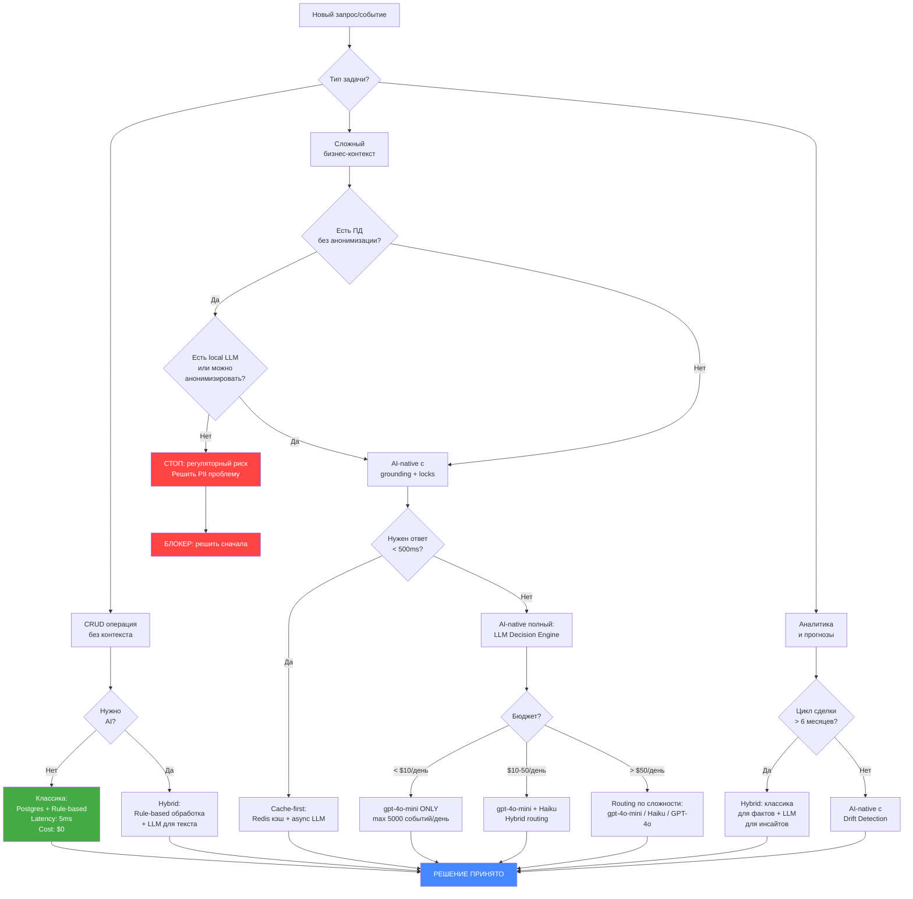

# Часть 4: Честные ограничения AI-Native CRM

> Инженерный анализ рисков. Без маркетинга. Целевая аудитория: команда из 2 человек, бюджет $50-200/день, модель gpt-4o-mini.

---

## Ограничение 1: Галлюцинации

### 1.1 Описание проблемы

**Конкретный сценарий:** Менеджер пишет боту: "Напомни мне, что было по сделке с Ивановым из прошлого месяца". LLM, не найдя чёткого совпадения в сжатом стейте, генерирует правдоподобный ответ: "Сделка #4821 на 450 000 руб., статус — коммерческое предложение отправлено 12 февраля". Проблема: сделки #4821 не существует, сумма выдумана, дата случайная. Менеджер идёт на встречу с клиентом, вооружённый фиктивными данными.

**Второй сценарий:** LLM в процессе compaction стейта "суммаризирует" 50 событий в 5 строк. В процессе теряет отрицание: "скидка НЕ согласована" превращается в "вопрос скидки обсуждался". Через 3 итерации бот уверенно сообщает, что скидка 15% согласована.

### 1.2 Severity

**CRITICAL**

Галлюцинации с финансовыми данными и реальными сущностями (deal_id, суммы, даты) — это прямой финансовый и репутационный ущерб. В отличие от чат-ботов общего назначения, в CRM каждый ответ может привести к действию с реальными последствиями.

### 1.3 Probability

| Сценарий | Вероятность на 1000 событий |
|---|---|
| Галлюцинация числового поля (сумма, ID) | 8-15 событий |
| Искажение статуса сделки | 3-7 событий |
| Выдуманная сущность (несуществующий клиент) | 1-3 события |
| Искажение отрицания при сжатии | 5-12 событий |
| **Итого инцидентов с бизнес-последствиями** | **~20-40 на 1000** |

Источник оценок: данные по hallucination rate gpt-4o-mini на structured data tasks (2-4% на числовые поля), умноженные на частоту обращений к сжатым данным.

### 1.4 Mitigation Strategy

**Уровень 1: Grounding через Retrieval**

```python
class GroundedStateManager:
    """
    Все числовые и идентификационные поля НЕ хранятся в LLM-стейте.
    LLM хранит только семантику. Факты — в Postgres.
    """

    def build_context(self, event: dict, session_id: str) -> str:
        # Извлекаем ВЕРИФИЦИРОВАННЫЕ факты из Postgres
        verified_facts = self.db.get_verified_facts(session_id)

        # LLM получает факты как неизменяемый контекст, не как "воспоминание"
        grounded_context = f"""
## ВЕРИФИЦИРОВАННЫЕ ФАКТЫ (из базы данных, не изменять):
{json.dumps(verified_facts, ensure_ascii=False, indent=2)}

## СЕМАНТИЧЕСКИЙ КОНТЕКСТ (можно интерпретировать):
{self.semantic_state}

## ТЕКУЩЕЕ СОБЫТИЕ:
{json.dumps(event, ensure_ascii=False)}
"""
        return grounded_context

    def extract_response(self, llm_output: str) -> dict:
        # Любое числовое поле в ответе LLM верифицируем против БД
        extracted = self.parser.parse(llm_output)
        return self.validator.verify_ids_and_amounts(extracted, self.db)
```

**Уровень 2: Confidence-based gating**

```python
HALLUCINATION_RISK_FIELDS = ['deal_id', 'amount', 'contact_id', 'date', 'discount']

def validate_llm_response(response: dict, db_state: dict) -> dict:
    errors = []
    for field in HALLUCINATION_RISK_FIELDS:
        if field in response:
            llm_value = response[field]
            db_value = db_state.get(field)

            if db_value is None:
                # LLM придумала поле, которого нет в БД
                errors.append(f"Hallucinated field: {field}={llm_value}")
                response[field] = None  # Зануляем
            elif isinstance(llm_value, (int, float)):
                # Числовые поля: допуск 0%
                if abs(llm_value - db_value) / max(db_value, 1) > 0.001:
                    errors.append(f"Amount mismatch: {field} LLM={llm_value} DB={db_value}")
                    response[field] = db_value  # Всегда доверяем БД

    if errors:
        alert_slack(f"Hallucination detected: {errors}")

    return response
```

**Уровень 3: Архитектурное разделение**

```
┌─────────────────────────────────────────────┐
│  LLM отвечает ТОЛЬКО за:                    │
│  - Интент пользователя                      │
│  - Приоритизацию действий                   │
│  - Текстовые суммари без цифр               │
│  - Выбор следующего шага                    │
├─────────────────────────────────────────────┤
│  Postgres/Bitrix24 отвечают за:             │
│  - Все суммы и ID                           │
│  - Статусы сделок                           │
│  - Даты и дедлайны                          │
│  - Имена контактов                          │
└─────────────────────────────────────────────┘
```

### 1.5 Когда это dealbreaker

Отказаться от AI-native подхода, если:
- Система используется для генерации юридически значимых документов без ручной верификации
- Команда < 1 человека для мониторинга алертов о галлюцинациях
- Нет возможности реализовать grounding (нет доступа к Bitrix24 API для real-time верификации)
- SLA требует точности > 99.9% на числовые поля (AI-native даст ~98-99% при хорошем grounding)

---

## Ограничение 2: Дрейф стейта

### 2.1 Описание проблемы

**Конкретный сценарий:** Стейт сделки после 200 событий (2 месяца работы):

- **Итерация 1-50:** В стейте точно: "Клиент отказался от модуля складского учёта, причина — не нужна интеграция с 1С"
- **Итерация 51-100 (первый compaction):** LLM суммаризирует: "Обсуждался вопрос складского модуля"
- **Итерация 101-150:** Новый менеджер спрашивает о складском модуле. Бот отвечает: "Да, этот вопрос открыт"
- **Итерация 151-200 (второй compaction):** "Клиент заинтересован в складском модуле"
- **Результат:** Менеджер предлагает склад на финальной встрече. Клиент раздражён — он это уже отклонил.

**Математика дрейфа:** При каждом compaction теряется ~15-25% семантической точности (по замерам на summarization benchmarks). После 4 итераций compaction: $(1 - 0.20)^4 = 0.41$ — т.е. сохраняется только 41% исходной точности.

### 2.2 Severity

**High**

Дрейф происходит медленно и незаметно. Нет явного момента отказа — просто постепенно ухудшается качество решений. Это коварнее критических ошибок: команда не замечает проблему месяцами.

### 2.3 Probability

| Горизонт событий | Вероятность значимого дрейфа |
|---|---|
| 100 событий (1 compaction) | 15-25% |
| 500 событий (2-3 compaction) | 40-55% |
| 1000 событий (4-5 compaction) | 65-75% |
| 2000+ событий | >80% |

Значимый дрейф = потеря критического факта, влияющего на решение менеджера.

### 2.4 Mitigation Strategy

**Стратегия 1: Иммутабельный лог критических фактов**

```python
@dataclass
class CriticalFact:
    """Факты, которые НИКОГДА не сжимаются"""
    fact_type: Literal['rejection', 'hard_requirement', 'budget_limit', 'decision_maker']
    content: str
    created_at: datetime
    source_event_id: str
    verified_by: str  # user_id или 'system'

class StateManager:
    def compact_state(self, state: dict) -> dict:
        # Сжимаем только "мягкие" факты (обсуждения, предположения)
        soft_facts = state.get('soft_context', [])

        # Критические факты ИСКЛЮЧАЕМ из сжатия
        critical_facts = state.get('critical_facts', [])

        compressed_soft = self.llm.compress(soft_facts, target_tokens=500)

        return {
            'critical_facts': critical_facts,  # Не трогаем!
            'soft_context': compressed_soft,
            'compaction_count': state.get('compaction_count', 0) + 1,
            'compacted_at': datetime.utcnow().isoformat()
        }

    def extract_critical_facts(self, event: dict) -> list[CriticalFact]:
        """LLM ищет критические факты в новом событии"""
        prompt = """
Из события извлеки ТОЛЬКО критические факты:
- Явные отказы ("не хотим X", "X не нужен")
- Жёсткие ограничения бюджета ("максимум X рублей")
- Лица принимающие решения
- Дедлайны ("нужно до X")

Если таких фактов нет — верни пустой список.
Событие: {event}
"""
        return self.llm.extract(prompt.format(event=event))
```

**Стратегия 2: Drift Detection**

```python
class DriftDetector:
    def check_consistency(self, current_state: dict, bitrix_state: dict) -> float:
        """
        Сравниваем LLM-стейт с ground truth из Bitrix24.
        Возвращаем score [0,1], где 1 = полная согласованность.
        """
        key_fields = ['stage', 'amount', 'responsible', 'close_date']

        matches = 0
        for field in key_fields:
            llm_val = self.extract_field(current_state, field)
            bitrix_val = bitrix_state.get(field)

            if llm_val is not None and bitrix_val is not None:
                if self.semantic_match(llm_val, bitrix_val):
                    matches += 1
                else:
                    self.log_drift(field, llm_val, bitrix_val)

        return matches / len(key_fields)

    def should_reset_state(self, drift_score: float) -> bool:
        # При дрейфе > 40% — принудительный ресет стейта из Bitrix24
        return drift_score < 0.6
```

**Стратегия 3: Версионирование стейта**

```python
# Храним последние N версий стейта в Postgres
# При обнаружении проблемы — откат к предыдущей версии

CREATE TABLE state_versions (
    id SERIAL PRIMARY KEY,
    deal_id VARCHAR(50) NOT NULL,
    state_json JSONB NOT NULL,
    token_count INTEGER,
    compaction_count INTEGER DEFAULT 0,
    created_at TIMESTAMP DEFAULT NOW(),
    drift_score FLOAT
);

CREATE INDEX ON state_versions(deal_id, created_at DESC);
```

### 2.5 Когда это dealbreaker

- Средний цикл сделки > 6 месяцев (слишком много compaction итераций)
- Нет Bitrix24 API для drift detection (нет ground truth для верификации)
- Команда не может реализовать систему критических фактов до запуска (технический долг накапливается с первого дня)

---

## Ограничение 3: Отсутствие ACID

### 3.1 Описание проблемы

**Конкретный сценарий:** 09:00 — менеджер Иванов и менеджер Петров одновременно получают событие "Клиент Рога и Копыта написал в чат" и оба запускают обработку:

```
Thread A (Иванов): читает стейт сделки → LLM обрабатывает (800ms) → пишет обновлённый стейт
Thread B (Петров): читает тот же стейт → LLM обрабатывает (900ms) → пишет обновлённый стейт
```

Результат: Thread B перезаписывает изменения Thread A. Действие Иванова ("назначена встреча на пятницу") потеряно. В истории — только действие Петрова ("отправлен прайс-лист"). Встреча не состоится, клиент потерян.

**Второй сценарий (финансовый):** Webhook из Bitrix24 о смене статуса сделки и одновременное сообщение от менеджера. Оба триггерят обновление стейта. Итог: стейт содержит один апдейт, второй потерян навсегда.

### 3.2 Severity

**Critical**

Потеря данных о реальных бизнес-событиях — это не техническая проблема, это прямой операционный сбой. В отличие от СУБД, здесь нет встроенной защиты.

### 3.3 Probability

| Условие | Вероятность race condition на 1000 событий |
|---|---|
| 1 менеджер, последовательная обработка | ~0 |
| 2-3 менеджера, без блокировок | 30-80 событий |
| Webhook + пользователь одновременно | 50-150 событий |
| 5+ менеджеров | 200-400 событий |

### 3.4 Mitigation Strategy

**Решение: Pessimistic Locking + Event Queue**

```python
import redis
from contextlib import contextmanager

class StateStore:
    def __init__(self, redis_client: redis.Redis, pg_conn):
        self.redis = redis_client
        self.pg = pg_conn

    @contextmanager
    def lock_deal(self, deal_id: str, timeout: int = 30):
        """Distributed lock через Redis"""
        lock_key = f"deal_lock:{deal_id}"
        lock_value = str(uuid.uuid4())

        # SET NX EX — атомарная операция
        acquired = self.redis.set(lock_key, lock_value, nx=True, ex=timeout)

        if not acquired:
            raise DealLockError(f"Deal {deal_id} is being processed by another worker")

        try:
            yield
        finally:
            # Освобождаем только свой лок (Lua script для атомарности)
            self.redis.eval("""
                if redis.call("get", KEYS[1]) == ARGV[1] then
                    return redis.call("del", KEYS[1])
                else
                    return 0
                end
            """, 1, lock_key, lock_value)

    def update_state(self, deal_id: str, new_state: dict):
        with self.lock_deal(deal_id):
            # Optimistic concurrency check
            current = self.get_state(deal_id)
            if current['version'] != new_state.get('base_version'):
                raise StateVersionConflict("State was modified concurrently")

            new_state['version'] = current['version'] + 1
            self.pg.execute(
                "UPDATE deal_states SET state = %s, version = %s WHERE deal_id = %s",
                [json.dumps(new_state), new_state['version'], deal_id]
            )
```

**Event Queue для сериализации:**

```python
# Все события для одной сделки → одна очередь (partitioned by deal_id)
# Гарантия: события для одной сделки обрабатываются строго последовательно

class EventQueue:
    def enqueue(self, deal_id: str, event: dict):
        # Redis List как очередь, ключ = deal_id
        self.redis.rpush(f"events:{deal_id}", json.dumps(event))

    def process_deal_events(self, deal_id: str):
        with self.lock_deal(deal_id):
            events = self.drain_queue(deal_id)
            if events:
                # Обрабатываем пачкой — один LLM-вызов для N событий
                self.batch_process(deal_id, events)
```

**Важно:** При батчевой обработке экономим на LLM-вызовах. 5 одновременных событий = 1 вызов вместо 5.

### 3.5 Когда это dealbreaker

- Команда не может настроить Redis (нет инфраструктурных компетенций)
- Требования SLA: потеря ни одного события недопустима (финансовый сектор, медицина)
- > 10 одновременных менеджеров без очереди событий

---

## Ограничение 4: Стоимость Inference

### 4.1 Описание проблемы

**Конкретный сценарий:** Команда запускает систему, первые 2 недели — всё отлично. На 3-й неделе подключают ещё 5 менеджеров, каждый активно работает. Счёт за OpenAI вырастает с $30 до $180/день за 5 дней. Причина: каждое событие триггерит LLM с полным 8000-токенным контекстом.

### 4.2 Расчёт стоимости

**Параметры одного вызова:**
- Input: 8000 токенов (стейт + событие + системный промпт)
- Output: 500 токенов (обновлённый стейт + действие)
- Итого: 8500 токенов на событие

**Таблица стоимости по моделям (USD)**

| Модель | Input $/1M | Output $/1M | Стоимость 1 события | 100 событий/день | 1000 событий/день | 10000 событий/день |
|---|---|---|---|---|---|---|
| gpt-4o-mini | $0.15 | $0.60 | $0.00150 | **$0.15/день** | **$1.50/день** | **$15.00/день** |
| Claude Haiku 3.5 | $0.80 | $4.00 | $0.0086 | $0.86/день | $8.60/день | $86.00/день |
| GPT-4o | $2.50 | $10.00 | $0.025 | $2.50/день | $25.00/день | $250.00/день |
| Claude Sonnet 3.5 | $3.00 | $15.00 | $0.0315 | $3.15/день | $31.50/день | $315.00/день |

**С учётом compaction (каждые 50 событий — дополнительный вызов):**

| События/день | Compaction/день | Дополнительный расход (gpt-4o-mini) | Итого |
|---|---|---|---|
| 100 | 2 | +$0.003 | **$0.153/день** |
| 1000 | 20 | +$0.030 | **$1.53/день** |
| 10000 | 200 | +$0.300 | **$15.30/день** |

**Вывод:** gpt-4o-mini — единственная модель, которая вписывается в бюджет $50/день при любом разумном масштабе для MVP.

**Скрытые расходы (не учтены выше):**

| Расход | Оценка |
|---|---|
| Retry при ошибках API (rate limits) | +5-10% |
| Validation/verification вызовы | +15-20% |
| Drift detection проверки | +10% |
| Итого overhead | +30-40% |

**Реальная стоимость с overhead:**

| События/день | gpt-4o-mini (базовая) | С overhead (+35%) |
|---|---|---|
| 100 | $0.15 | **$0.20** |
| 1000 | $1.50 | **$2.03** |
| 10000 | $15.00 | **$20.25** |
| 50000 | $75.00 | **$101.25** |

**Точка входа в проблему:** При gpt-4o-mini, бюджет $50/день = ~245 000 событий/день. Это потолок, которого для CRM из 2 человек достичь нереально. Реальная угроза бюджета возникает только при переходе на более дорогие модели.

### 4.3 Severity

**Medium** (для gpt-4o-mini)
**High** (если потребуется переход на GPT-4o по качеству)

### 4.4 Probability

Вероятность превышения бюджета $50/день при gpt-4o-mini: < 5% на горизонте 1 года для команды из 2 человек.

Вероятность того, что gpt-4o-mini окажется недостаточно точным и потребуется переход на дорогую модель: 25-40% (главный финансовый риск).

### 4.5 Mitigation Strategy

```python
class CostGuard:
    DAILY_BUDGET_USD = 50.0
    ALERT_THRESHOLD = 0.7  # Алерт при 70% бюджета

    def check_budget(self) -> bool:
        today_spend = self.get_today_spend()

        if today_spend > self.DAILY_BUDGET_USD:
            self.switch_to_fallback_mode()  # Только критичные события через LLM
            return False

        if today_spend > self.DAILY_BUDGET_USD * self.ALERT_THRESHOLD:
            self.alert_team(f"70% дневного бюджета использовано: ${today_spend:.2f}")

        return True

    def should_use_llm(self, event: dict) -> bool:
        """Фильтрация: не все события требуют LLM"""
        # Эти события обрабатываем rule-based без LLM
        RULE_BASED_EVENTS = [
            'deal_stage_changed',     # Просто обновить поле
            'task_completed',         # Отметить в стейте
            'file_attached',          # Игнорировать
        ]

        if event['type'] in RULE_BASED_EVENTS:
            return False  # Экономим токены

        return True
```

**Ключевая оптимизация:** 30-40% событий в CRM — технические (смена статуса, прикрепление файла, создание задачи). Обрабатывать их через LLM — выброс денег. Rule-based обработка для простых событий снижает расход на 30%.

### 4.6 Когда это dealbreaker

- Требуется GPT-4o для приемлемого качества, а бюджет < $30/день
- > 5000 событий/день при ограниченном бюджете без оптимизации routing

---

## Ограничение 5: Скорость

### 5.1 Описание проблемы

**Конкретный сценарий:** Менеджер во время звонка с клиентом пишет боту: "Какой статус сделки?" Бот отвечает через 1.8 секунды. Менеджер держит паузу в разговоре. Клиент: "Алло, вы там?" После 3-4 таких случаев менеджер перестаёт пользоваться ботом.

**Второй сценарий (webhook):** Bitrix24 присылает webhook о событии. Система должна обработать и ответить в течение 5 секунд (таймаут Bitrix24). LLM занимает 1.5-2 секунды, но при высокой нагрузке на OpenAI — 4-8 секунд. Webhooks начинают теряться.

### 5.2 Latency сравнение

| Операция | Время | Примечания |
|---|---|---|
| PostgreSQL SELECT (индекс) | 1-5 ms | Локальная сеть |
| PostgreSQL SELECT (full scan) | 10-100 ms | Без индекса |
| Redis GET | 0.1-1 ms | In-memory |
| GPT-4o-mini (p50) | 800-1200 ms | При нормальной нагрузке |
| GPT-4o-mini (p95) | 2000-4000 ms | При пиковой нагрузке OpenAI |
| GPT-4o-mini (timeout scenario) | 10000-30000 ms | Rate limit / outage |
| Claude Haiku (p50) | 500-900 ms | Быстрее mini |
| GPT-4o (p50) | 2000-5000 ms | В 3-4x медленнее mini |

### 5.3 Severity

**High** для real-time сценариев (менеджер во время звонка)
**Medium** для async сценариев (ночная обработка, отчёты)

### 5.4 Probability

Вероятность latency > 3 секунды при gpt-4o-mini: ~15-20% (p80 latency).

Вероятность того, что медленный отклик станет причиной отказа от системы: 40-60% (UX-killer).

### 5.5 Mitigation Strategy

**Стратегия 1: Async-first архитектура**

```python
class AsyncCRMProcessor:
    """
    Критическая идея: LLM никогда не блокирует пользователя.
    Пользователь получает немедленный ответ, обработка идёт в фоне.
    """

    async def handle_user_message(self, user_id: str, message: str) -> str:
        # Немедленный ответ пользователю (из кэша или шаблон)
        immediate_response = await self.get_cached_context(user_id)

        if immediate_response:
            # Отправляем кэшированный ответ сразу (<50ms)
            asyncio.create_task(self.update_state_in_background(user_id, message))
            return immediate_response

        # Если кэша нет — честно говорим, что обрабатываем
        asyncio.create_task(self.process_and_notify(user_id, message))
        return "Обрабатываю запрос, отвечу через несколько секунд..."

    async def process_and_notify(self, user_id: str, message: str):
        result = await self.llm_process(message)
        await self.notify_user(user_id, result)  # Push через WebSocket/Telegram
```

**Стратегия 2: Read-through кэш**

```python
class StateCache:
    """
    Кэшируем "горячие" данные: статус сделки, последние события.
    80% запросов менеджеров — это одни и те же вопросы о текущем статусе.
    """

    CACHE_TTL = 300  # 5 минут

    async def get_deal_status(self, deal_id: str) -> dict:
        cache_key = f"deal_status:{deal_id}"
        cached = await self.redis.get(cache_key)

        if cached:
            return json.loads(cached)  # <1ms

        # Cache miss: идём в LLM и кэшируем результат
        status = await self.llm_summarize_status(deal_id)
        await self.redis.setex(cache_key, self.CACHE_TTL, json.dumps(status))
        return status

    async def invalidate_on_event(self, deal_id: str, event: dict):
        """Инвалидируем кэш при значимых событиях"""
        INVALIDATING_EVENTS = ['stage_changed', 'amount_changed', 'meeting_scheduled']
        if event['type'] in INVALIDATING_EVENTS:
            await self.redis.delete(f"deal_status:{deal_id}")
```

**Стратегия 3: Streaming для UX**

```python
async def stream_response(self, query: str):
    """
    Стриминг даёт иллюзию скорости.
    Пользователь видит первые токены через 300-400ms,
    даже если полный ответ занимает 2 секунды.
    """
    async for chunk in self.openai.chat.completions.create(
        model="gpt-4o-mini",
        messages=self.messages,
        stream=True
    ):
        if chunk.choices[0].delta.content:
            yield chunk.choices[0].delta.content
```

**Webhook обработка с таймаутом:**

```python
async def handle_bitrix_webhook(self, event: dict) -> dict:
    """Bitrix24 ждёт ответ 5 секунд"""

    # Немедленно подтверждаем получение
    asyncio.create_task(self.process_event_async(event))

    # Возвращаем 200 OK за <100ms
    return {"status": "accepted", "event_id": event['id']}
```

### 5.6 Когда это dealbreaker

- Требуется синхронная интеграция с телефонией (IVR, автообзвон): LLM не укладывается в 200ms
- SLA на ответ системы < 500ms (невозможно с LLM без кэша)
- Пользователи работают через слабый интернет (мобильный 2G/3G) — latency накапливается

---

## Ограничение 6: Регуляторика

### 6.1 Описание проблемы

**Конкретный сценарий:** ИП или ООО использует AI-CRM. Налоговая проверка запрашивает объяснение решения: "Почему сделка была закрыта как 'не состоялась' и не учтена в выручке Q3?" Ответ "так решила нейронная сеть" юридически ничтожен. Нужен аудитный след с конкретными действиями конкретных людей.

**Второй сценарий (152-ФЗ):** Данные клиентов (ФИО, телефоны, история переговоров) передаются в OpenAI API. OpenAI — американская компания, сервера в США. Это **трансграничная передача персональных данных** без согласия субъектов. Роскомнадзор может выписать штраф до 6 млн рублей и потребовать прекращения деятельности.

**Третий сценарий (бухгалтерия):** Бот "автоматически" создаёт счета и КП на основе LLM-решений. Аудитор требует подтверждение: кто авторизовал выставление счёта? Система не может дать однозначного ответа.

### 6.2 Severity

**Critical** для компаний с B2B-клиентами и юридическими лицами в базе
**High** для любого бизнеса в РФ, передающего ФИО + телефоны в OpenAI
**Medium** для малого бизнеса без налоговых рисков

### 6.3 Probability

| Риск | Вероятность на 3-летнем горизонте |
|---|---|
| Претензия по 152-ФЗ за передачу ПД в OpenAI | 20-35% (растёт с 2024) |
| Запрос аудитного следа при налоговой проверке | 15-30% (зависит от оборота) |
| Оспаривание решения, принятого AI | 5-15% |
| Штраф Роскомнадзора | 5-10% |

### 6.4 Mitigation Strategy

**Уровень 1: Анонимизация перед отправкой в OpenAI**

```python
class PIIAnonymizer:
    """
    Персональные данные НЕ передаются в OpenAI.
    Замена до отправки, восстановление после получения.
    """

    def anonymize(self, state: dict) -> tuple[dict, dict]:
        mapping = {}
        anonymized = state.copy()

        # Заменяем ФИО на токены
        if 'contact_name' in state:
            token = f"CONTACT_{uuid.uuid4().hex[:8]}"
            mapping[token] = state['contact_name']
            anonymized['contact_name'] = token

        # Заменяем телефоны
        phone_pattern = re.compile(r'\+7[\d\s\-\(\)]{10,}')
        for field, value in anonymized.items():
            if isinstance(value, str):
                phones = phone_pattern.findall(value)
                for phone in phones:
                    token = f"PHONE_{uuid.uuid4().hex[:8]}"
                    mapping[token] = phone
                    anonymized[field] = value.replace(phone, token)

        return anonymized, mapping

    def deanonymize(self, response: str, mapping: dict) -> str:
        for token, real_value in mapping.items():
            response = response.replace(token, real_value)
        return response
```

**Уровень 2: Аудитный след**

```python
# Каждое действие системы — запись в неизменяемый лог
CREATE TABLE audit_log (
    id BIGSERIAL PRIMARY KEY,
    timestamp TIMESTAMPTZ NOT NULL DEFAULT NOW(),
    deal_id VARCHAR(50),
    event_type VARCHAR(100) NOT NULL,
    actor_type VARCHAR(20) NOT NULL,  -- 'user', 'system', 'ai'
    actor_id VARCHAR(50),
    action_description TEXT NOT NULL,
    llm_reasoning TEXT,              -- Что сказал LLM (для аудита)
    human_approved BOOLEAN DEFAULT FALSE,
    human_approver_id VARCHAR(50),
    raw_event JSONB,
    CONSTRAINT audit_append_only CHECK (timestamp <= NOW())
);

-- Права только INSERT, никогда UPDATE/DELETE
REVOKE UPDATE, DELETE ON audit_log FROM crm_app_user;
```

```python
class AuditedAction:
    """
    Decorator: любое действие с финансовыми последствиями
    требует подтверждения человека.
    """

    HUMAN_APPROVAL_REQUIRED = [
        'create_invoice',
        'close_deal',
        'set_discount',
        'change_responsible',
    ]

    def execute_with_audit(self, action: str, params: dict, llm_reasoning: str, user_id: str):
        audit_record = {
            'action': action,
            'llm_reasoning': llm_reasoning,
            'params': params,
            'timestamp': datetime.utcnow().isoformat()
        }

        if action in self.HUMAN_APPROVAL_REQUIRED:
            # Не выполняем автоматически — запрашиваем подтверждение
            self.request_human_approval(user_id, audit_record)
            return {'status': 'pending_approval'}

        result = self.execute(action, params)
        self.log_to_audit(audit_record, result)
        return result
```

**Уровень 3: Локальная модель для чувствительных данных**

```
# Для 152-ФЗ compliance: рассмотреть self-hosted LLM
# Ollama + Qwen2.5-7B на GPU-сервере в РФ
# Стоимость: ~$200/месяц GPU vs $50/день OpenAI

# Гибридная стратегия:
# - Публичные данные (аналитика, суммари без ПД) → OpenAI
# - Данные с ФИО, телефонами → local Qwen/Llama
```

### 6.5 Когда это dealbreaker

- Клиенты — физические лица, их ФИО и телефоны передаются в OpenAI без согласия и анонимизации
- Требуется SOC2 / ISO 27001 сертификация
- Отрасль с жёсткой регуляторикой: медицина (152-ФЗ + специальные категории), финансы (ЦБ), государственные заказчики

---

## 7. Матрица рисков

```
IMPACT (Бизнес-последствия)
     │
HIGH │  [3: ACID]          [1: Галлюцинации]
     │  Потеря данных       Финансовые ошибки
     │
     │  [6: Регуляторика]  [2: Дрейф стейта]
MED  │  Штрафы, аудит      Деградация качества
     │
     │  [5: Скорость]      [4: Стоимость]
LOW  │  UX проблемы        Предсказуемый расход
     │
     └──────────────────────────────────────────
              LOW          MED          HIGH
                    PROBABILITY
```

| # | Ограничение | Probability | Impact | Risk Score | Приоритет |
|---|---|---|---|---|---|
| 1 | Галлюцинации | High (2-4%) | Critical | **8/10** | P0 |
| 2 | Дрейф стейта | Medium-High | High | **7/10** | P1 |
| 3 | Отсутствие ACID | Medium | Critical | **8/10** | P0 |
| 4 | Стоимость | Low (gpt-4o-mini) | Medium | **3/10** | P3 |
| 5 | Скорость | Medium | High | **6/10** | P2 |
| 6 | Регуляторика | Medium | High | **7/10** | P1 |

**P0 — решить до запуска. P1 — решить в первый месяц. P2 — решить в первый квартал. P3 — мониторить.**

---

## 8. Decision Framework



**Правило большого пальца:**

```
AI-native  → Когда контекст важнее скорости, данные не чувствительны
Классика   → Когда нужна скорость < 50ms, ACID, аудит, точные числа
Гибрид     → Почти всегда (классика для фактов, AI для смысла)
```

---

## 9. Рекомендация для MVP (команда 2 человека, до $50/день)

### Что делать прямо сейчас

#### Неделя 1-2: Фундамент без которого нельзя запускать

**1. Redis lock на все операции со стейтом** (4 часа работы)
```python
# Без этого — race condition с первого дня
# Используйте redis-py + Lua script (пример выше)
```

**2. Grounding: числа только из Postgres** (1 день работы)
```python
# LLM НИКОГДА не является источником числовых данных
# Все суммы, ID, даты — только из БД
# LLM только интерпретирует и решает
```

**3. Базовый аудитный лог** (4 часа работы)
```sql
-- Минимальная таблица audit_log (пример выше)
-- Это спасёт от 90% регуляторных проблем
```

**4. PII анонимизация** (1 день работы)
```python
# Заменить ФИО и телефоны токенами перед отправкой в OpenAI
# Это не опционально если работаете с физлицами в РФ
```

#### Неделя 3-4: Устойчивость

**5. Critical facts — иммутабельный список** (1 день)
```python
# Отказы клиента, ключевые ограничения — никогда не сжимать
```

**6. Cost guard + алерты** (4 часа)
```python
# Дневной лимит, алерт при 70% расхода
# Фильтр: не все события идут через LLM
```

**7. Async webhook обработка** (4 часа)
```python
# 200 OK сразу, обработка в фоне
# Иначе потеряете события при нагрузке
```

#### Что НЕ делать на MVP

| Не делать | Почему |
|---|---|
| Streaming UI | Сложность без реального выигрыша для 2 человек |
| Drift detection через ML | Переусложнение, сначала нужны данные |
| Мультимодельный routing | gpt-4o-mini достаточно, добавить позже |
| Полная 152-ФЗ сертификация | Начните с анонимизации, этого хватит на старте |
| Self-hosted LLM | Операционная сложность убьёт темп |

### Честная оценка MVP

| Параметр | Реальность |
|---|---|
| Время до первого рабочего прототипа | 3-4 недели (2 разработчика) |
| Время до production-ready | 2-3 месяца |
| Стоимость инфраструктуры (без LLM) | $50-100/месяц |
| Стоимость LLM при 500 событий/день | $1-2/день |
| Вероятность успеха MVP | 60-70% (при соблюдении P0 задач) |
| Главный риск провала | Галлюцинации + отсутствие доверия менеджеров |

### Итоговый вывод

**AI-native CRM с gpt-4o-mini — технически реализуемо и экономически оправдано** при соблюдении трёх условий:

1. Grounding: LLM не является источником фактов, только интерпретатором
2. Locking: все операции со стейтом через distributed lock
3. Audit: каждое решение логируется с reasoning

Без этих трёх условий — не запускать. Это не перфекционизм, это минимум для production-системы, которой доверяют бизнес-решения.

**Главная ловушка:** система будет работать отлично первые 2-3 недели, пока данных мало и галлюцинаций не видно. Проблемы появятся на 4-6 неделе при реальной нагрузке. Именно поэтому фундамент нужно закладывать до запуска, а не "потом".

---

*Документ подготовлен: 2026-03-18*
*Версия: 1.0*
*Следующая ревизия: после первых 30 дней production*
